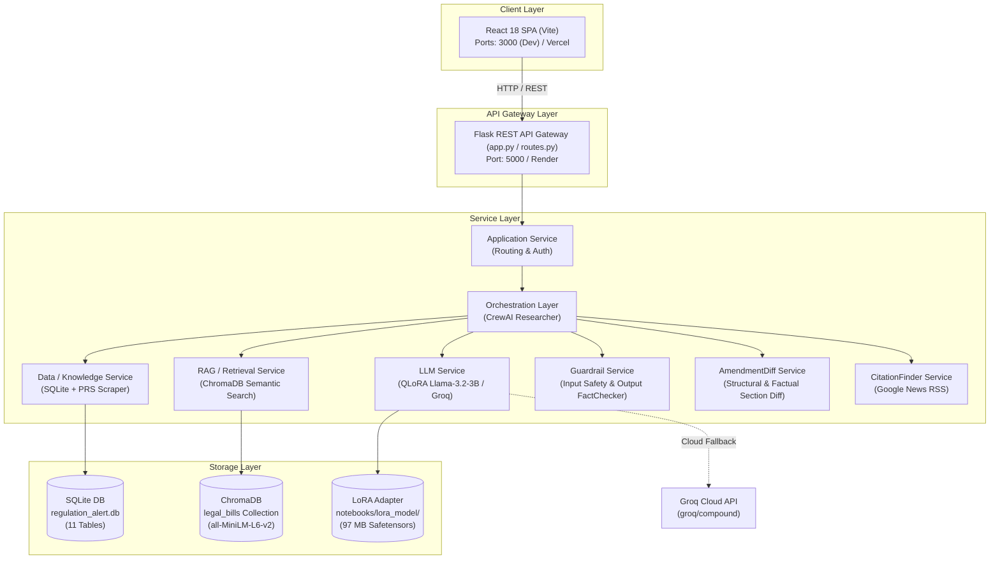
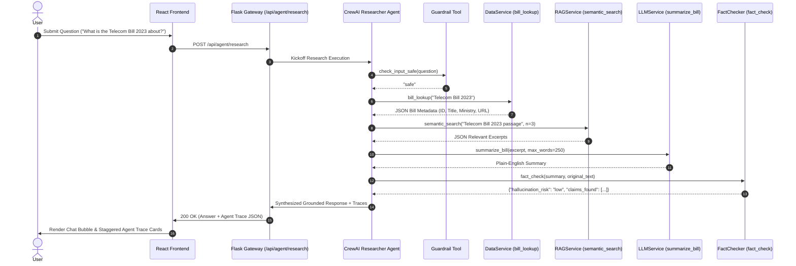
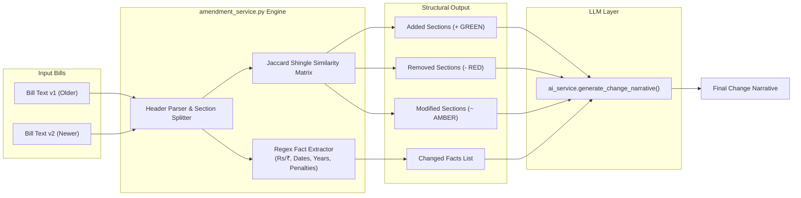
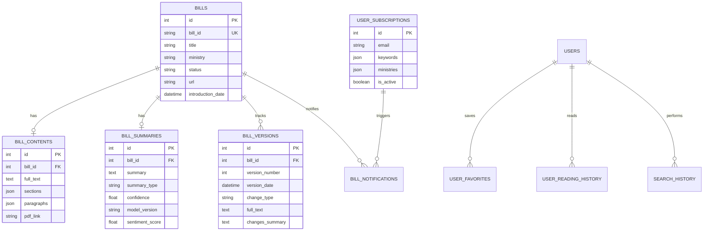

# 🏗️ VidhanAI Architecture Specification

> **Service-Oriented Architecture (SOA) & Multi-Agent System Specification**

This document provides a comprehensive technical overview of VidhanAI's microservice design, agent orchestration graph, vector search pipeline, and database schema.

---

## 1. System Context & Microservices Diagram

VidhanAI follows a strict **Service-Oriented Architecture (SOA)** where Flask acts as an API Gateway forwarding user requests to independent, decoupled service components.

---

## 2. Multi-Agent Orchestration Sequence

When a user submits a question on the `/research` page, the request executes through the following CrewAI agent orchestration flow:

---

## 3. Delta-Aware Amendment Diff Architecture

The **AmendmentDiff Service** (`services/amendment_service.py`) implements structural section diffing between two bill versions without invoking an LLM for the diff computation itself (keeping execution deterministic and cost at $0):

---

## 4. Database Schema (SQLite 11-Table ER Diagram)

---

## 5. Live Architecture Endpoint (`/api/architecture`)

The `/api/architecture` endpoint generates a live JSON inventory of all registered services, tools, data stores, and model backends. This fulfills the **IDE-like interface** criteria by letting reviewers inspect system capabilities directly through the frontend at `/architecture`.
