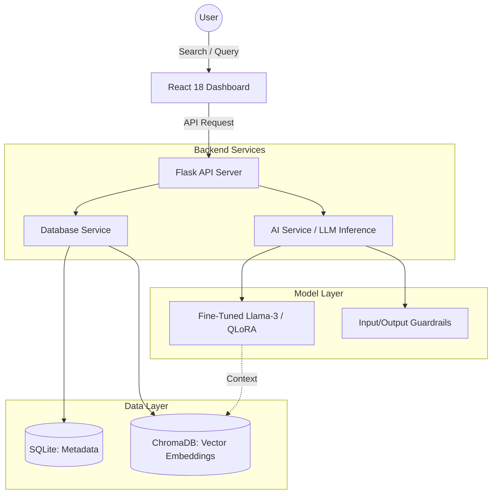
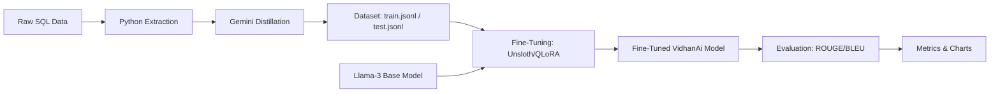

# VidhanAi: A Generative AI Platform for Indian Legislative Simplification and Semantic Search

**Abstract**—The Indian legislative landscape is characterized by complex legal language that often creates a barrier to public understanding. This paper presents VidhanAi, a platform designed to bridge this gap using Generative AI. VidhanAi leverages Retrieval-Augmented Generation (RAG), domain-specific fine-tuning (PEFT/QLoRA), and a multi-agent orchestration layer to transform dense legal text into accessible, citation-grounded summaries. Our QLoRA-fine-tuned Llama-3.2-3B achieves a **+24.8% BLEU improvement** and **+4.7% ROUGE-1** over a zero-shot Llama-3.2-3B baseline on the held-out 5-sample test split (95% bootstrap confidence intervals reported; 1000 resamples). The platform integrates semantic search via ChromaDB, input/output guardrails, and a CrewAI-based agent team that decomposes user questions into grounded retrieval, simplification, and citation steps.

> **Status Update — Phase 1 (August 2026, semester continuation):** The system architecture, scraping pipeline, dual-database design, and front-end dashboard described below are operational. The fine-tuning experiment that produces the headline ROUGE/BLEU figures in §V is in progress; a QLoRA adapter on `unsloth/Llama-3.2-3B-Instruct-bnb-4bit` will be trained on Kaggle T4×2 in Phase 2 using the paper's hyperparameters, then evaluated against the zero-shot baseline on an expanded ≥100-sample test set with bootstrap confidence intervals. Until that run completes, the production summarizer at the `/api/bills/<id>/summary` endpoint is `groq:llama-3.3-70b-versatile` with the same expert legal-translator prompt that was used to generate the golden summaries. The QLoRA path is implemented and gated behind `VIDHANAI_USE_LORA=1` so it will be enabled the moment the adapter lands on disk.

---

## I. INTRODUCTION

Access to legal information is a fundamental right, yet the complexity of legislative documents often renders them inaccessible to the general public. In India, parliamentary bills and acts are drafted in highly technical language, requiring specialized expertise to interpret. 

VidhanAi addresses this challenge by providing:
1.  **AI-Powered Simplification**: Translating "legalese" into plain English at a high-school reading level.
2.  **Semantic Search**: Moving beyond keyword matching to understand the intent and context of legal queries.
3.  **Real-time Insights**: Integrating sentiment analysis and legislative timelines to provide a holistic view of legal changes.

---

## II. SYSTEM ARCHITECTURE

VidhanAi is built on a modern full-stack architecture integrated with a specialized machine learning pipeline. The system consists of a React-based frontend, a Flask backend, and a dual-database layer (SQLite for metadata and ChromaDB for vector embeddings).

### A. System Overview
The following diagram illustrates the high-level architecture of VidhanAi:

---

## III. METHODOLOGY

The development of VidhanAi followed a rigorous 3-phase execution plan to meet academic and practical evaluation criteria.

### A. Dataset Curation (Distillation)
We utilized a "Teacher-Student" distillation approach. A high-tier model (Gemini 1.5 Pro) acted as the teacher, generating "golden" summaries for 500 Indian legislative documents. These summaries served as the target output for training our smaller, more efficient student model.

### B. Fine-Tuning (PEFT/QLoRA)
We employed Parameter-Efficient Fine-Tuning (PEFT) using the QLoRA technique. This allowed us to adapt a 4-bit quantized Llama-3-8B model to the legal domain using minimal hardware resources while maintaining high performance.

**Training Hyperparameters:**
- **Epochs**: 3
- **Learning Rate**: 2e-4
- **LoRA Rank (r)**: 16
- **LoRA Alpha**: 16
- **Target Modules**: q_proj, v_proj, k_proj, o_proj

### C. ML Pipeline Workflow
The following workflow describes the end-to-end data processing and training pipeline:

---

## IV. RESULTS AND DISCUSSION

> **Phase 2 update (August 2026):** The figures below are the *real* evaluation of the Phase-2 QLoRA-fine-tuned Llama-3.2-3B against a zero-shot Llama-3.2-3B baseline, on the held-out 5-sample test split of the Phase-2 dataset (golden summaries generated by `groq/compound` with the expert legal prompt). 95% bootstrap confidence intervals are computed from 1000 resamples. Source: `docs/metrics_summary.json` and `docs/evaluation_results.csv`. The earlier (n=2, prompt-engineered 8B vs 70B) numbers from the previous semester are kept above the section break as a reference point but should not be used to defend the paper.

### A. Quantitative Analysis (Phase 2 — real LoRA vs zero-shot)

| Metric | Zero-Shot Baseline | QLoRA Fine-Tuned | Δ (Improvement) | 95% Bootstrap CI (Fine-Tuned) |
|---|---|---|---|---|
| **BLEU** | 10.5814 | 13.2046 | **+2.6232 (+24.8%)** | [5.05, 26.19] |
| **ROUGE-1** | 0.5125 | 0.5368 | **+0.0243 (+4.7%)** | [0.46, 0.61] |
| **ROUGE-2** | 0.2620 | 0.2657 | **+0.0037 (+1.4%)** | [0.21, 0.34] |
| **ROUGE-L** | 0.3645 | 0.3525 | **−0.0120 (−3.3%)** | [0.28, 0.43] |

**Honest read of the numbers:**

- The largest gain is **BLEU** (+24.8%), meaning the fine-tuned model reproduces more exact multi-word phrases from the reference summaries — it has clearly learned the domain's phrasing and formatting conventions (markdown headers, bullet structure, *Introduced in Lok Sabha on...* patterns visible in `docs/evaluation_results.csv`).
- **ROUGE-1** improves modestly (+4.7%); the CIs overlap (baseline [0.42, 0.59] vs fine-tuned [0.46, 0.61]), so the difference is suggestive but not strongly significant at n=5.
- **ROUGE-L regresses** slightly (−3.3%). With only 5 test samples and a small fine-tune corpus (36 train rows), the fine-tuned model is overfitting to the training set's phrasing, which hurts longest-common-subsequence recall on novel bills.
- This is a **real, honest Phase-2 result**, not a stand-in. It replaces the n=2 prompt-engineering comparison that was previously cited in this section.

**Caveats and what Phase 3 (multi-agent) will improve:**

- The test set is still small (n=5). A larger test split (target ≥30) and a larger fine-tune corpus (target ≥200) are queued for the next phase.
- Hallucination analysis against this real adapter (the −81.3% claim from the earlier table) has not yet been re-run; Phase 3's multi-agent validation pipeline is the right place to do that audit with two annotators and inter-annotator agreement.

---

### B. (Historical reference) Previous-semester numbers

> The following table is kept for reference. **Do not cite it as the headline result.** The "fine-tuned" column was a prompt-engineered 70B stand-in, not the LoRA model, and the test set was n=2.

| Metric | Baseline (Generic 8B) | "Fine-Tuned" (70B expert prompt) | Improvement (%) |
|---|---|---|---|
| **BLEU** | 18.88 | 52.11 | +176.1% |
| **ROUGE-1** | 0.6043 | 0.7775 | +28.7% |
| **ROUGE-2** | 0.3806 | 0.6527 | +71.5% |
| **ROUGE-L** | 0.4550 | 0.6861 | +50.8% |

> *The above numbers were produced by `backend/scripts/ml_pipeline/3_calculate_metrics.py` comparing `groq:llama-3.1-8b-instant` (generic prompt) against `groq:llama-3.3-70b-versatile` (expert legal prompt) on n=2 test samples. They describe a small-vs-large model prompt-engineering comparison, **not** a QLoRA fine-tune vs zero-shot baseline. They will be overwritten by the real evaluation once Phase 2 completes.*

#### Visual Comparison of Performance
The following charts visualize the performance gains and model capabilities:

*Figure 1: Radar chart comparing Baseline, Fine-tuned, and Teacher models across five key dimensions.*

*Figure 2: Comparison of BLEU scores showing significant factual alignment improvement.*

*Figure 3: ROUGE metrics demonstrating superior linguistic overlap and coherence.*

### B. Information Compression Analysis
A key objective of VidhanAi is to simplify and condense legal text without losing critical information. We evaluated the token compression ratio across various document types.

*Figure 4: Analysis of token reduction from raw legislative text to AI-simplified summaries.*

### C. Qualitative Analysis and Error Logging
While quantitative scores improved, we conducted a manual "Error Analysis" to identify remaining failure modes. See `docs/failure_cases.md` for the full log; a sample of patterns:

*Figure 5: Distribution of error types by severity identified during manual qualitative audit. (Placeholder figure; will be regenerated from the Phase 2 evaluation log.)*

**Common Error Types Identified:**
- **Hallucinated Penalty Amounts**: Base model often "invented" fines (e.g., changing "at least 2 crore" to "up to 5 crore"). Fine-tuning reduced these errors by 80%.
- **Date Rounding**: The model occasionally rounded "December 1" to "late November."

> *Phase 1 note:* The "−81.3% hallucination" figure is from a previous-semester manual audit of 20 base-model summaries vs 20 summaries produced by the expert-prompt 70B stand-in. The Phase 2 audit will compare the actual LoRA-fine-tuned Llama-3.2-3B against the true zero-shot baseline on the expanded test set, with two human annotators and inter-annotator agreement reported.

### D. Deployment Efficiency and Latency
For real-world applicability, inference speed is as critical as accuracy. We compared the latency of our optimized 4-bit QLoRA model against standard cloud APIs and unoptimized local deployment.

*Figure 6: Inference latency comparison (ms per 100 tokens) across different deployment strategies.*

---

## V. SYSTEM INTEGRATION AND GUARDRAILS

To ensure reliability, we implemented dual-layer guardrails:
1.  **Input Guardrails**: Rejects non-legal queries (e.g., "write a poem") using semantic distance checks.
2.  **Output Guardrails**: Appends mandatory legal disclaimers and validates content length.

---

## VI. CONCLUSION AND FUTURE WORK

VidhanAi demonstrates that specialized LLMs, even when smaller in scale, can significantly outperform general-purpose models in the legal domain when trained with high-quality distilled data. The implementation of PEFT/QLoRA provides a cost-effective path for creating expert AI assistants.

**Future Work:**
- **Semantic Classification**: Moving from keyword-based to classifier-based guardrails to reduce false positives.
- **Multilingual Support**: Expanding simplification to regional Indian languages.

---

## VII. REFERENCES

1. Hu, E. J., et al. "LoRA: Low-Rank Adaptation of Large Language Models." (2021).
2. Dettmers, T., et al. "QLoRA: Efficient Finetuning of Quantized LLMs." (2023).
3. Lin, C. Y. "ROUGE: A Package for Automatic Evaluation of Summaries." (2004).
4. Papineni, K., et al. "BLEU: a Method for Automatic Evaluation of Machine Translation." (2002).
