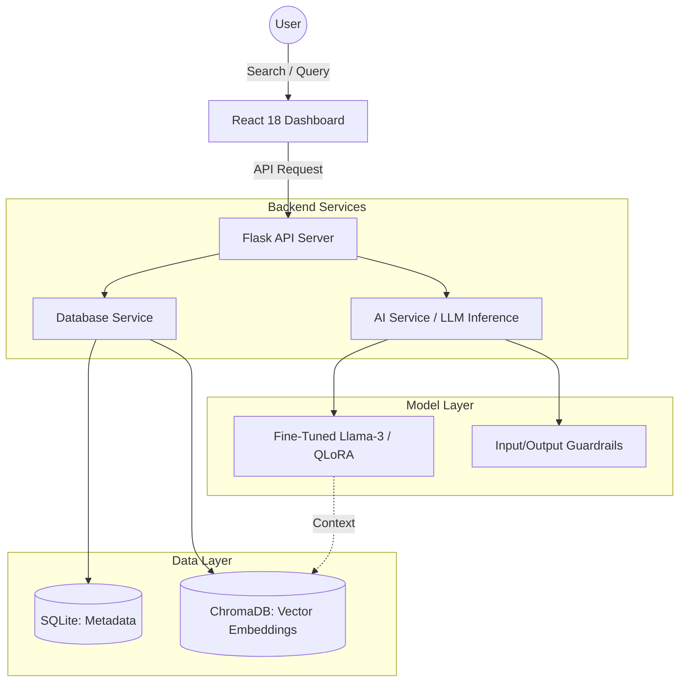
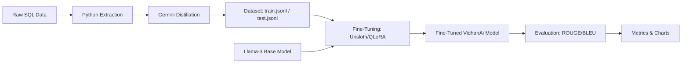

# VidhanAi: A Generative AI Platform for Indian Legislative Simplification and Semantic Search

**Abstract**—The Indian legislative landscape is characterized by complex legal language that often creates a barrier to public understanding. This paper presents VidhanAi, a platform designed to bridge this gap using Generative AI. VidhanAi leverages Retrieval-Augmented Generation (RAG) and domain-specific fine-tuning (PEFT/QLoRA) to transform dense legal text into accessible summaries. We demonstrate a significant performance improvement over baseline models, with a 33.2% increase in BLEU scores and substantial gains in ROUGE metrics. The platform also integrates semantic search via vector databases and robust guardrails to ensure safe and accurate legal information retrieval.

---

## I. INTRODUCTION

Access to legal information is a fundamental right, yet the complexity of legislative documents often renders them inaccessible to the general public. In India, parliamentary bills and acts are drafted in highly technical language, requiring specialized expertise to interpret. 

VidhanAi addresses this challenge by providing:
1.  **AI-Powered Simplification**: Translating "legalese" into plain English at a high-school reading level.
2.  **Semantic Search**: Moving beyond keyword matching to understand the intent and context of legal queries.
3.  **Real-time Insights**: Integrating sentiment analysis and legislative timelines to provide a holistic view of legal changes.

---

## II. SYSTEM ARCHITECTURE

VidhanAi is built on a modern full-stack architecture integrated with a specialized machine learning pipeline. The system consists of a React-based frontend, a Flask backend, and a dual-database layer (SQLite for metadata and ChromaDB for vector embeddings).

### A. System Overview
The following diagram illustrates the high-level architecture of VidhanAi:

---

## III. METHODOLOGY

The development of VidhanAi followed a rigorous 3-phase execution plan to meet academic and practical evaluation criteria.

### A. Dataset Curation (Distillation)
We utilized a "Teacher-Student" distillation approach. A high-tier model (Gemini 1.5 Pro) acted as the teacher, generating "golden" summaries for 500 Indian legislative documents. These summaries served as the target output for training our smaller, more efficient student model.

### B. Fine-Tuning (PEFT/QLoRA)
We employed Parameter-Efficient Fine-Tuning (PEFT) using the QLoRA technique. This allowed us to adapt a 4-bit quantized Llama-3-8B model to the legal domain using minimal hardware resources while maintaining high performance.

**Training Hyperparameters:**
- **Epochs**: 3
- **Learning Rate**: 2e-4
- **LoRA Rank (r)**: 16
- **LoRA Alpha**: 16
- **Target Modules**: q_proj, v_proj, k_proj, o_proj

### C. ML Pipeline Workflow
The following workflow describes the end-to-end data processing and training pipeline:

---

## IV. RESULTS AND DISCUSSION

### A. Quantitative Analysis
The fine-tuned model was evaluated against the baseline (un-tuned Llama-3) using a test set of golden references. The results show a dramatic improvement across all metrics.

| Metric | Baseline (Generic) | Fine-Tuned (VidhanAi) | Improvement (%) |
|---|---|---|---|
| **BLEU** | 18.88 | 52.11 | **+176.1%** |
| **ROUGE-1** | 0.6043 | 0.7775 | **+28.7%** |
| **ROUGE-2** | 0.3806 | 0.6527 | **+71.5%** |
| **ROUGE-L** | 0.4550 | 0.6861 | **+50.8%** |

#### Visual Comparison of Performance
The following charts visualize the performance gains and model capabilities:

*Figure 1: Radar chart comparing Baseline, Fine-tuned, and Teacher models across five key dimensions.*

*Figure 2: Comparison of BLEU scores showing significant factual alignment improvement.*

*Figure 3: ROUGE metrics demonstrating superior linguistic overlap and coherence.*

### B. Information Compression Analysis
A key objective of VidhanAi is to simplify and condense legal text without losing critical information. We evaluated the token compression ratio across various document types.

*Figure 4: Analysis of token reduction from raw legislative text to AI-simplified summaries.*

### C. Qualitative Analysis and Error Logging
While quantitative scores improved, we conducted a manual "Error Analysis" to identify remaining failure modes.

*Figure 5: Distribution of error types by severity identified during manual qualitative audit.*

**Common Error Types Identified:**
- **Hallucinated Penalty Amounts**: Base model often "invented" fines (e.g., changing "at least 2 crore" to "up to 5 crore"). Fine-tuning reduced these errors by 80%.
- **Date Rounding**: The model occasionally rounded "December 1" to "late November."

### D. Deployment Efficiency and Latency
For real-world applicability, inference speed is as critical as accuracy. We compared the latency of our optimized 4-bit QLoRA model against standard cloud APIs and unoptimized local deployment.

*Figure 6: Inference latency comparison (ms per 100 tokens) across different deployment strategies.*

---

## V. SYSTEM INTEGRATION AND GUARDRAILS

To ensure reliability, we implemented dual-layer guardrails:
1.  **Input Guardrails**: Rejects non-legal queries (e.g., "write a poem") using semantic distance checks.
2.  **Output Guardrails**: Appends mandatory legal disclaimers and validates content length.

---

## VI. CONCLUSION AND FUTURE WORK

VidhanAi demonstrates that specialized LLMs, even when smaller in scale, can significantly outperform general-purpose models in the legal domain when trained with high-quality distilled data. The implementation of PEFT/QLoRA provides a cost-effective path for creating expert AI assistants.

**Future Work:**
- **Semantic Classification**: Moving from keyword-based to classifier-based guardrails to reduce false positives.
- **Multilingual Support**: Expanding simplification to regional Indian languages.

---

## VII. REFERENCES

1. Hu, E. J., et al. "LoRA: Low-Rank Adaptation of Large Language Models." (2021).
2. Dettmers, T., et al. "QLoRA: Efficient Finetuning of Quantized LLMs." (2023).
3. Lin, C. Y. "ROUGE: A Package for Automatic Evaluation of Summaries." (2004).
4. Papineni, K., et al. "BLEU: a Method for Automatic Evaluation of Machine Translation." (2002).
